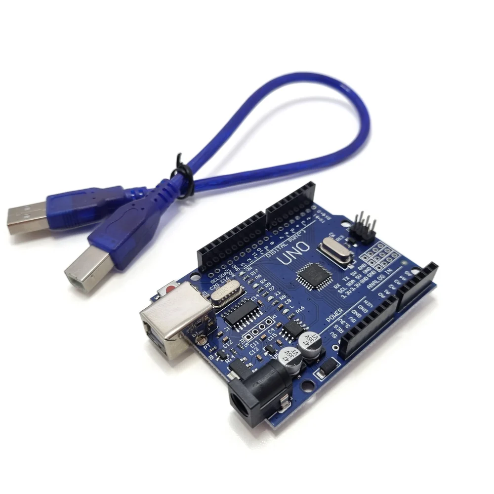
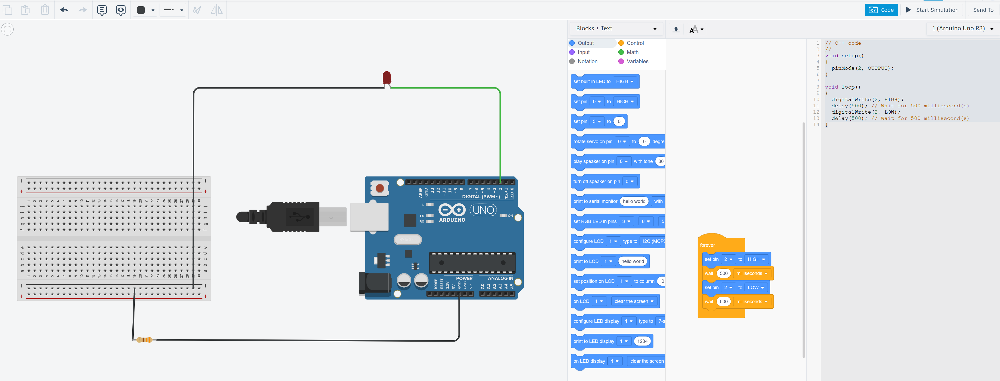
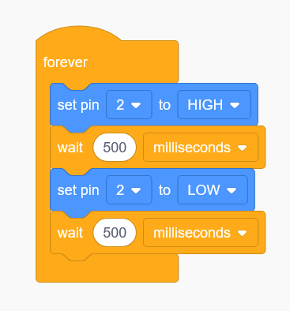

# Electronics - Arduino

## Overview
This section covers basic electronics topics such as circuits, components, and coding applications.

## Components

| Component | Quantity | Description |
| ---- | ---- | ---- |
| LED | 4-12 | Light emitting diode |
| Arduino U3 board | 1 | Single board micro-controller |
| USB-A to USB-B | 1 | Connect laptop to Arduino |
| Breadboard | 1 | Prototyping board for electronic circuits |
| Jumper wires M-F | 24 (max) | Wires to connect components together. 2 per LED |
| Jumper wires F-F | 1 | Wires to connect components together, used to connect ground (GND) on the board to the breadboard |
| Resistors | 1 | 220ohm resistor, not strictly required but does prevent long term damage to the LEDs |
| Button switch | 1 | Used to turn on/off the lights |
| 9V battery connector | 1 | Used to connect a 9V battery to the Arduino |
| 9V battery | 1 | Supplied by the student to power the Arduino |

## Circuit

### Arduino R3
{ width=400px }

### Wiring Diagram
Prototyping for the wiring should be completed in [Tinkercad](https://www.tinkercad.com){_target="_blank"}. 

### Single LED
The following is an example of a single LED circuit:


[Single LED](https://www.tinkercad.com/things/kkQHkIKUoyR-single-blinking-led-with-arduino-uno-r3?sharecode=3k4RYoQzOZmV0RcPYYIvoxR_r7VOnOd-WWfWoUc0cpw)

=== "Block"
    

=== "C++"

    ```cpp
    // C++ code
    void setup()
    {
        pinMode(2, OUTPUT);
    }

    void loop()
    {
        digitalWrite(2, HIGH);
        delay(500); // Wait for 500 millisecond(s)
        digitalWrite(2, LOW);
        delay(500); // Wait for 500 millisecond(s)
    }
    ```


**Key points:**

- Anode pin of the LED is connected to the digital output pin (e.g., D13) and the cathode pin is connected to ground.
    - Anode has a longer pin
    - Cathode has a shorter pin and a flat base on the LED
- The LED will light up when the digital output pin is set to HIGH.
- A 220ohm or 330ohm resistor is used to limit the current and prevent damage to the LED.
- The resistor is connected between the digital output pin and ground.
- Output pins P0 and P1 should be avoided as they have special features that may impact the operation of the LEDs

## Coding
For the coding we expect to see students design a sequence of lights that turn on in a specific order. They should implement at least 3 different sequences.

The software required for the Arduino is [Arduino IDE](https://www.arduino.cc/en/software/). Students should download a copy onto their laptop and install. 

!!! Note
    Teachers must make a Sentral support request to the IT team to have the Arduino IDE installed on their DoE supplied laptop.

### Upload Steps

1. Copy the C++ code from Tinkercad and paste into the Arduino IDE
2. Select the Arduino Uno board from the dropdown menu
3. Click the `Verify` button to ensure the code compiles
4. Connect the Arduino Uno to the laptop
5. Click the `Upload` button to compile and send the code to the Arduino board
6. If everything is wired correctly and the code compiles the LEDs should start their sequence immediately.

### Differentiation
- Students who are not familiar with C or C++ (most students) can design their code using block coding in Tinkercad.
- The code will need to be converted to C++ in Tinkercad by selecting the `Blocks + Text` edit mode.
- Students with an aptitude for C++ should be encouraged to use C++ and also incorporate more complex logic into their code.
    - `while` loops
    - `if` statements
    - functions

## Common Issues
| Issue | Solution |
| --- | --- |
| LED not lighting up | Check the polarity of the LED and ensure it is connected correctly. |
| Resistor value too high or too low | Adjust the resistor value to a suitable level (220ohm or 330ohm). |
| LED not blinking | Check that a full circuit has been done connecting the LED, resistor, power source and ground |
| LED always on | Ensure that delays have been include between turning off and turning on the LED. |
| Student has a Mac | Students will need a dongle or USB hub to connect their Arduino R3 to their Mac. |
| Unable to connect or upload code | Check that the correct port is selected in the Arduino IDE. Ensure that the board type and port are correctly set. On rare occasions, the board may need to be replaced. Check if you can upload from another laptop and that all wiring is correct before replacing. There are spare boards available. |
