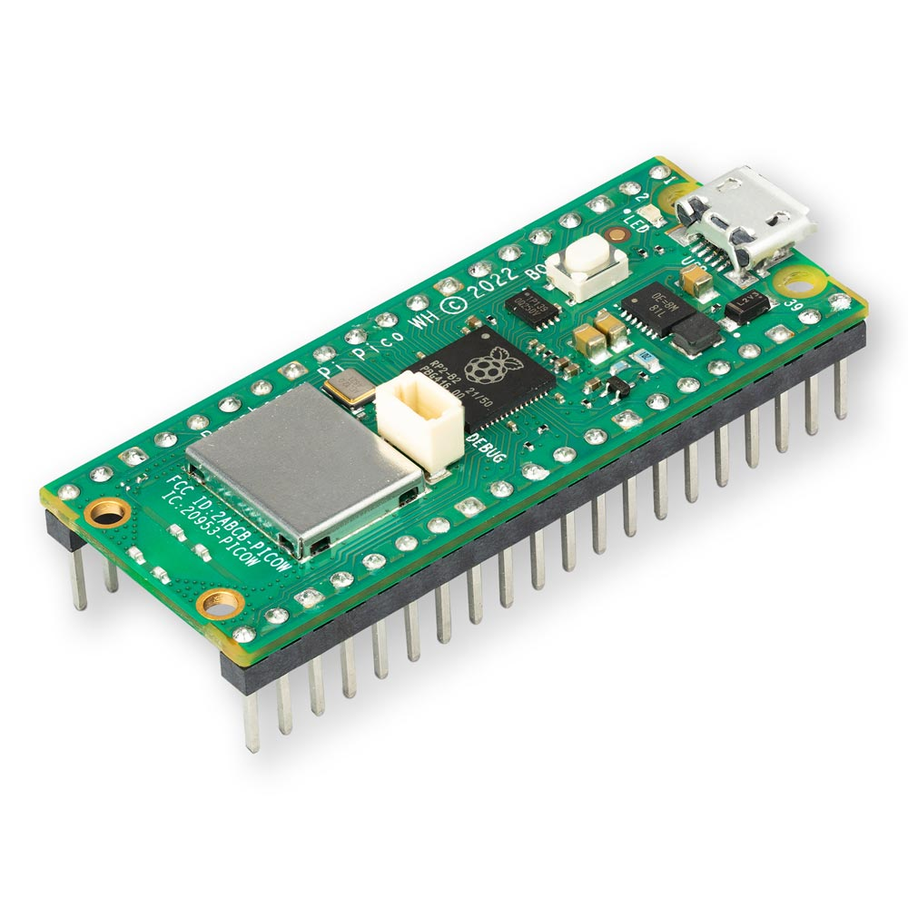
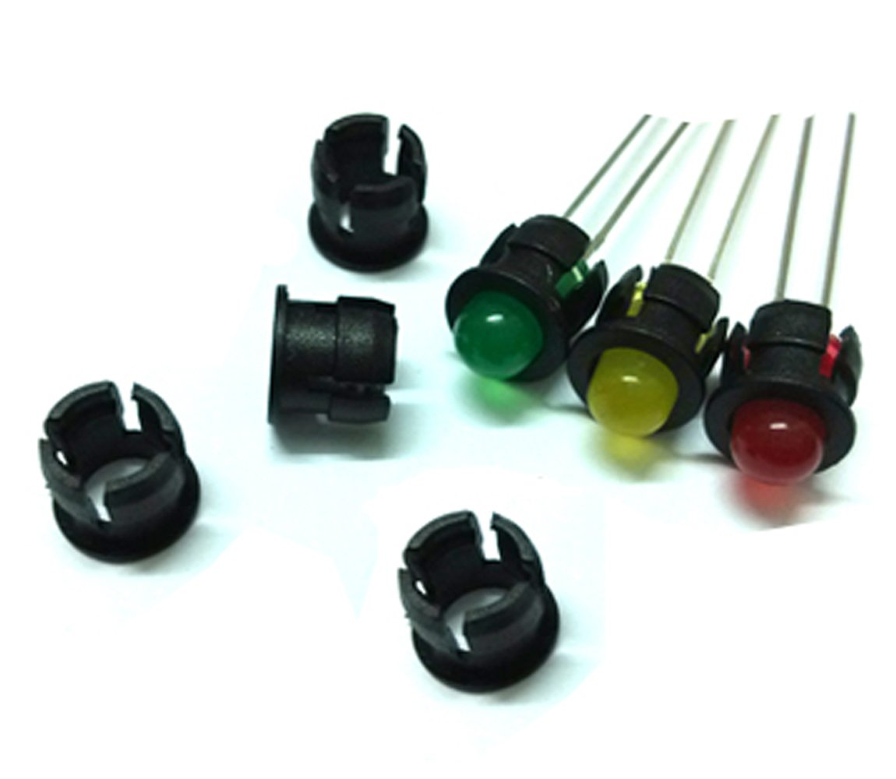
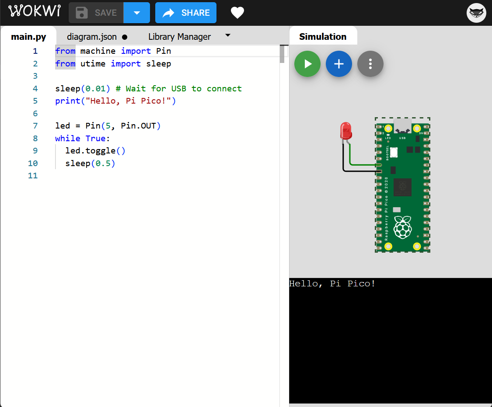
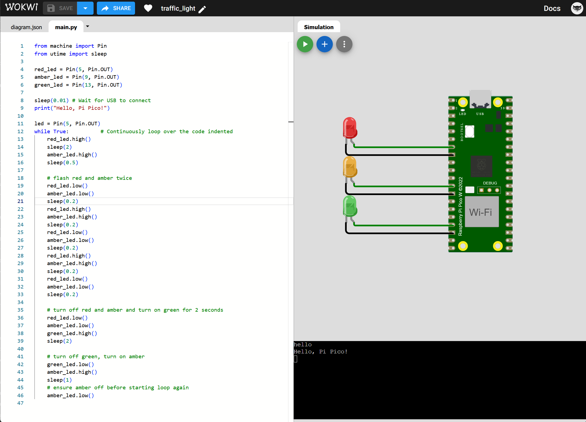

# Raspberry Pi Pico

## Overview
The Raspberry Pi Pico is a small, low-cost microcontroller board that can be used for various projects.


## Components

### Per Class
| Component | Quantity | Description |
| ---- | ---- | ---- |
| USB-A to Micro USB | 3 | Connect Laptops to the Raspberry Pi Pico |
| USB-C to Micro USB | 3 | Connect MacBooks to the Raspberry Pi Pico |

### Per Student
| Component | Quantity | Description | Image |
| ---- | ---- | ---- | ---- |
| Raspberry Pi Pico | 1 | Single board micro-controller |  |
| Breadboard | 1 | Prototyping board for electronic circuits |
| Jumper wires M-F | 24 (max) | Wires to connect components together. 2 per LED |
| Jumper wires F-F | 1 | Wires to connect components together, used to connect ground (GND) on the board to the breadboard |
| Resistors | 1 | 220ohm resistor, not strictly required but does prevent long term damage to the LEDs |
| Button switch | 1 | Used to turn on/off the lights |
| 5mm LEDs | 4-12 | Light emitting diode (various colours)|
| 5mm Flat LED Holder | 4-12 | Holder for the flat 5mm LEDs |  |

### Student Supplied
| Component | Quantity | Description | Image |
| ---- | ---- | ---- | ---- |
| 9V Battery | 1 | Power supply for the Raspberry Pi Pico | 
| Paints | Various | Students should take their lid and box if required and decorate it with paints at home. |

## Software
- Students and teachers will need to install [Thonny](https://thonny.org/) on their laptop to program their Raspberry Pi Pico.
- [Wokwi](https://www.wokwi.com){_target="_blank"} will be used for prototyping and testing the circuits. 

## Circuit

### Wiring Diagram
Prototyping for the wiring should be completed in [Wokwi](https://www.wokwi.com){_target="_blank"}. 

### Single LED
The following is an example of a single LED circuit:
[](https://wokwi.com/projects/300504213470839309){_target="_blank"}

**Key Points:**

- When using Python you need to use indentation to define the body of a function or loop.

### Multiple LEDs
The following is an example of a multiple LED circuit that demonstrates traffic lights:
[](https://wokwi.com/projects/431541307875514369){_target="_blank"}

=== "Advanced"

    - Replace the code in the traffic light demonstration above with the code in the `Looping` tab. 
    - Notice the result is the same but the code is more efficient. 
    - We use a second loop inside the first loop to reduce the amount of code written and to make the code more readable.

=== "Looping"

    ``` python
    from machine import Pin
    from utime import sleep

    print('hello')

    sleep(0.01) # Wait for USB to become ready in seconds

    red_led = Pin(5, Pin.OUT)
    amber_led = Pin(9, Pin.OUT)
    green_led = Pin(13, Pin.OUT)

    led = Pin(5, Pin.OUT)
    while True:          # Continuously loop over the code indented
        red_led.high()
        sleep(2)
        amber_led.high()
        sleep(0.5)

        # flash red and amber twice
        count = 0
        while count < 2:
            red_led.low()
            amber_led.low()
            sleep(0.2)
            red_led.high()
            amber_led.high()
            count = count + 1
            sleep(0.2)

        red_led.low()
        amber_led.low()
        sleep(0.2)

        # turn off red and amber and turn on green for 2 seconds
        red_led.low()
        amber_led.low()
        green_led.high()
        sleep(2)

        # turn off green, turn on amber
        green_led.low()
        amber_led.high()
        sleep(1)
        # ensure amber off before starting loop again
        amber_led.low()
    ```
